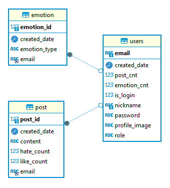

# PROJECT : 감정 공유 커뮤니티 Emoti  

## 📝 프로젝트 개요 
이 프로젝트는 사용자들이 감정을 공유할 수 있는 커뮤니티를 통해 사용자의 일별 감정 데이터를 수집하고, 이를 기반으로 사용자의 감정 변화를 분석하는 것을 목표로 합니다. Spring Boot를 활용하여 REST API 서버를 구축하였으며, HTML 및 CSS를 이용하여 웹 페이지를 개발하였습니다.

>EMOTI = Emotion + Emoticon

</br></br>

## 📆 프로젝트 기간 

| 날짜 | 업무 내용 |
| --- | --- |
| 2023.03.08 ~ 2023.03.11 | 프로젝트 기획, 주제 선정, 자료 조사 |
| 2023.03.11 ~ 2023.03.20 | 웹페이지 구성 및 RESTful API 생성|
| 2023.03.20 ~ 2023.03.27 | Spring Security, Exception handler 추가|
## 🕺 구성원

| 구성원 | 깃허브 주소 | 분담 역할 |
| --- | --- | --- |
| 장윤영 | ht

</br></br>
tps://github.com/Jyundev | REST API 구축  <br>  Spring Security, Exception 처리|
| 조하민 | https://github.com/chohaming | REST API 구축 <br>  프론트엔드 개발|
| 김도한 | https://github.com/rlaehgks115 |Emoti UI 디자인 및  프론트엔드 개발 |
| 김백운 | https://github.com/kimbw0615 | Emoti UI  디자인 및 프론트엔드  개발

</br></br>


## 🖥️ Stack

- **Language** : JAVA, HTML, CSS, JavaScript
- **Library & Framework** : Spring Boot, Lombok
- **Database** : JDBC, MySQL, DBeaver
- **Collaboration** : Git, Notion, Slack


</br></br>

## 🔗 ERD 


## 📁 프로젝트 구조


```
Emoti
└─ src
   ├─ main
   │  ├─ java
   │  │  └─ com
   │  │     └─ mini
   │  │        └─ emoti
   │  │           ├─ EmotiApplication.java
   │  │           ├─ config
   │  │           │  ├─ BaseEntity.java
   │  │           │  ├─ SecurityConfig.java
   │  │           │  ├─ WebConfig.java
   │  │           │  ├─ auth
   │  │           │  │  ├─ AuthProvider.java
   │  │           │  │  ├─ AuthUserDto.java
   │  │           │  │  └─ AuthUserService.java
   │  │           │  ├─ constant
   │  │           │  │  ├─ AuthenticationTypes.java
   │  │           │  │  ├─ EmotionTypes.java
   │  │           │  │  ├─ Role.java
   │  │           │  │  └─ error
   │  │           │  │     └─ ErrorCode.java
   │  │           │  ├─ error
   │  │           │  │  ├─ ControllerExceptionHandler.java
   │  │           │  │  └─ ErrorResponse.java
   │  │           │  └─ handler
   │  │           │     ├─ LoginAuthFailureHandler.java
   │  │           │     ├─ LoginAuthSuccessHandelr.java
   │  │           │     └─ LogoutAuthSuccessHandler.java
   │  │           ├─ controller
   │  │           │  ├─ PublicController.java
   │  │           │  ├─ UserApiController.java
   │  │           │  └─ UserController.java
   │  │           ├─ model
   │  │           │  ├─ dao
   │  │           │  │  ├─ EmotionDao.java
   │  │           │  │  ├─ PostDao.java
   │  │           │  │  ├─ UserDao.java
   │  │           │  │  └─ impl
   │  │           │  │     ├─ EmotionDaoImpl.java
   │  │           │  │     ├─ PostDaoImpl.java
   │  │           │  │     └─ UserDaoImpl.java
   │  │           │  ├─ dto
   │  │           │  │  ├─ EmotionDto.java
   │  │           │  │  ├─ PostDto.java
   │  │           │  │  └─ UserDto.java
   │  │           │  ├─ entity
   │  │           │  │  ├─ EmotionEntity.java
   │  │           │  │  ├─ PostEntity.java
   │  │           │  │  └─ UserEntity.java
   │  │           │  └─ repository
   │  │           │     ├─ EmotionRepository.java
   │  │           │     ├─ PostRepository.java
   │  │           │     └─ UserRepository.java
   │  │           └─ service
   │  │              ├─ EmotionService.java
   │  │              ├─ PostService.java
   │  │              ├─ UserService.java
   │  │              └─ impl
   │  │                 ├─ EmotionServiceImpl.java
   │  │                 ├─ PostServiceImpl.java
   │  │                 └─ UserServiceImpl.java
   │  └─ resources
   │     ├─ .DS_Store
   │     ├─ application.yaml
   │     ├─ data.sql
   │     ├─ static
   │     │  ├─ css
   │     │  │  ├─ assets
   │     │  │  │  └─ favicon.ico
   │     │  │  ├─ login.css
   │     │  │  ├─ mypage
   │     │  │  │  └─ styles.css
   │     │  │  └─ styles.css
   │     │  ├─ img
   │     │  │  ├─ main
   │     │  │  │  ├─ google.png
   │     │  │  │  ├─ kakao.png
   │     │  │  │  ├─ naver.png
   │     │  │  │  ├─ news.png
   │     │  │  │  ├─ smile.png
   │     │  │  │  ├─ soso.jpg
   │     │  │  │  ├─ stock.png
   │     │  │  │  ├─ stock2.jpg
   │     │  │  │  ├─ stock3.png
   │     │  │  │  ├─ 놀람.png
   │     │  │  │  ├─ 슬픔.png
   │     │  │  │  ├─ 평온.png
   │     │  │  │  ├─ 행복.png
   │     │  │  │  └─ 화남.png
   │     │  │  └─ mypage
   │     │  │     ├─ Graph.png
   │     │  │     ├─ angry.png
   │     │  │     ├─ backimage.jpg
   │     │  │     ├─ basic.png
   │     │  │     ├─ face.ico
   │     │  │     ├─ happy.png
   │     │  │     ├─ profile.jpg
   │     │  │     ├─ sad.png
   │     │  │     ├─ soso.png
   │     │  │     └─ suprise.png
   │     │  └─ js
   │     │     └─ scripts.js
   │     └─ templates
   │        ├─ close.html
   │        ├─ index.html
   │        ├─ login
   │        │  ├─ join.html
   │        │  └─ login.html
   │        └─ member
   │           ├─ graphs.html
   │           ├─ index.html
   │           ├─ mypage.html
   │           └─ posts.html
   └─ test
      └─ java
         └─ com
            └─ mini
               └─ emoti
                  ├─ EmotiApplicationTests.java
                  └─ PublicTest.java


